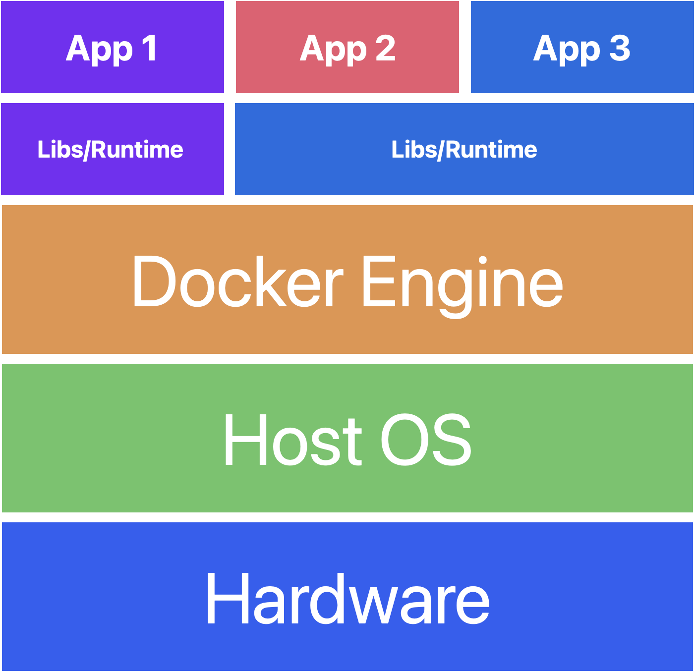
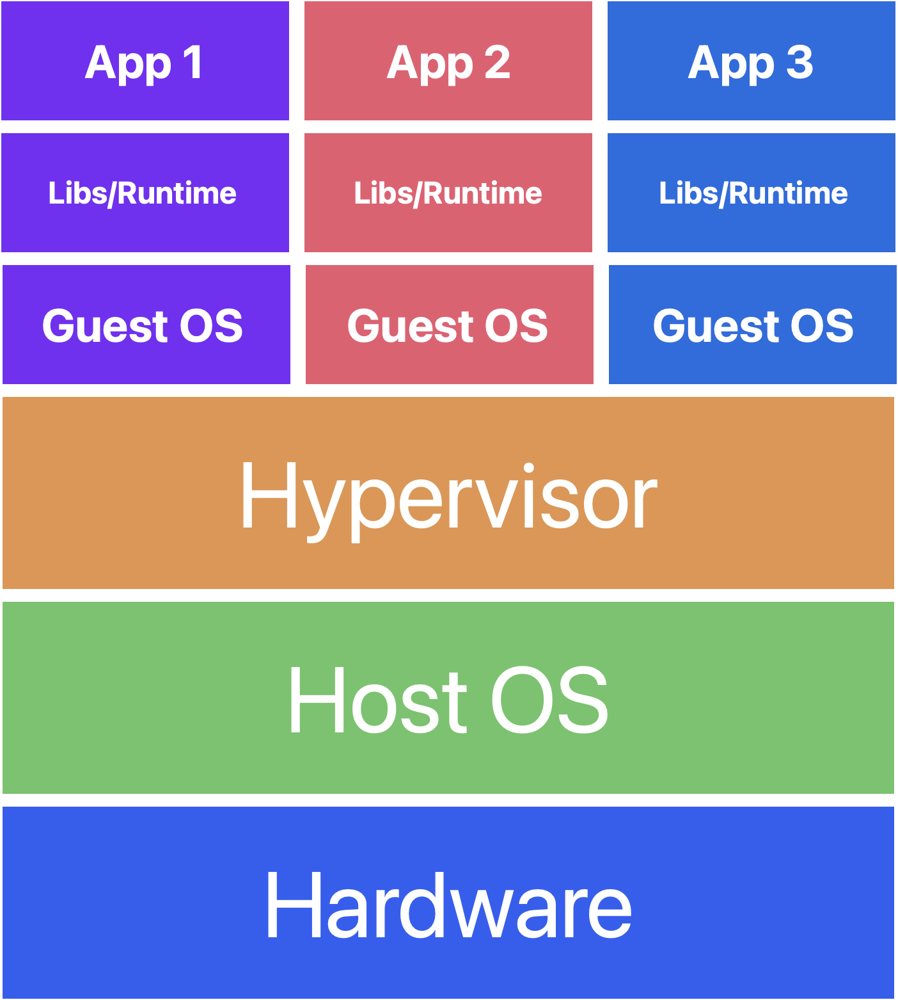

# What is docker?

Docker is an open source platform that enables developers to build, deploy, run, update and manage containers—standardized, executable components that combine application source code with the operating system (OS) libraries and dependencies required to run that code in any environment.

Containers simplify development and delivery of distributed applications.

[What is docker?](https://www.ibm.com/topics/docker)

# Docker vs VM
[Virtual Machine (VM) vs Docker](https://www.youtube.com/watch?v=a1M_thDTqmU&ab_channel=IBMTechnology)

1. Architecture: Docker containers share the host OS kernel, while VMs run their own complete guest OS on top of a hypervisor.

2. Resource utilization: Docker containers are lightweight and consume fewer resources than VMs.

3. Startup time: Docker containers can start up much faster than VMs.

4. Isolation: VMs provide stronger isolation between applications due to running a complete guest OS, while Docker containers share the host OS kernel but use Linux namespaces and cgroups to provide some level of isolation.

5. Portability: Docker containers are highly portable, as they can run on any system with the Docker runtime installed. VMs can be more difficult to move between systems due to differences in hypervisor configurations and guest OS images.

6. Maintenance: Docker containers can be easier to maintain than VMs, as they can be updated and redeployed more quickly.

7. Security: VMs provide stronger security guarantees due to their stronger isolation between applications, while Docker containers rely on the security of the host OS kernel and additional security measures such as containerization technologies and network policies.

8. Use cases: Docker containers are often used for application deployment and microservices architecture, while VMs are commonly used for running legacy applications, multi-tenant hosting, and virtual desktops.

### Docker architecture

### VM architecture

# Code
The project is a basic ToDo app composed of three parts:

1. Backend: A flask app for manage tasks
2. Frontend: A React app to display tasks
3. Database: A postgres instance to store the data

Each of them will be packaged into containers that will interact to each other.

# Docker
